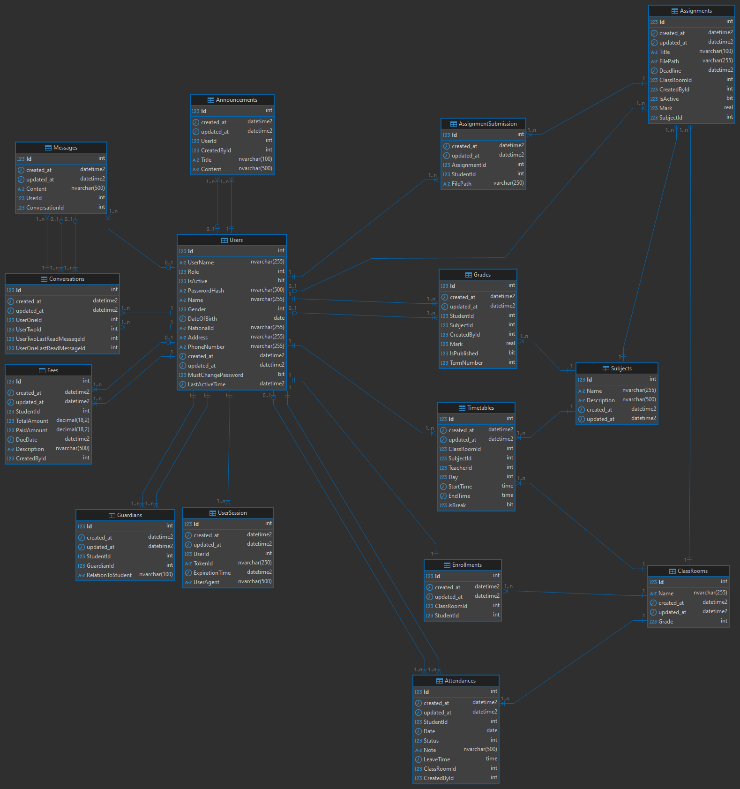

# MySchool API 

**MySchool API** is a school management system built using **ASP.NET Core Web API**. It provides RESTful endpoints for managing assignments, users, and dashboards based on user roles (Admin, Teacher, Student, Guardian).


## **Database Diagram**



## Getting Started

### Prerequisites

- .NET SDK 9.0 or later
- SQL Server
- Visual Studio / VS Code

### Setup Instructions

```bash
git clone https://github.com/amrshaheen20/MySchool.git
cd MySchool
dotnet build
dotnet ef migrations add Initial 
dotnet ef database update
dotnet run
